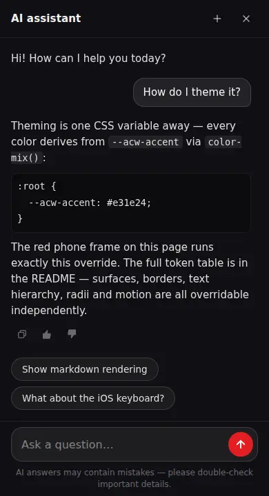

# astro-chat-widget

[](https://www.npmjs.com/package/astro-chat-widget)
[](https://www.npmjs.com/package/astro-chat-widget)
[](./LICENSE)

A self-contained AI chat widget for [Astro](https://astro.build) sites. Floating action button → native `<dialog>` panel → streaming answers over SSE. No React, no runtime framework — one dependency ([`streaming-markdown`](https://github.com/thetarnav/streaming-markdown)), plain TypeScript and CSS.

Built for content/marketing sites that have an AI backend (RAG, support bot) and want a production-quality chat UI without shipping a component framework for it.

<p align="center">
  
</p>

<p align="center">
  <sub>The self-running showcase from <code>npm run demo</code> — the widget answering from the mock SSE backend.</sub>
</p>

## Features

- **Zero JS in the initial bundle** — the shell renders static HTML; the chat module lazy-loads on first interaction (and prefetches on FAB hover).
- **Streaming markdown** — append-only parser (no re-render flicker), word-by-word reveal at an adaptive cadence, honest auto-scroll that never fights the user.
- **A companion, not a modal.** The dialog always opens **non-modally**. On desktop that means an Intercom-style floating panel: the page behind stays scrollable and interactive, clicking the page doesn't close the chat (Esc, with focus in the panel, does), and an open panel survives navigation — it reopens instantly on the next page until the user closes it.
- **iOS keyboard that actually works.** iOS Safari clips the `<dialog>` top layer to the visual viewport while the software keyboard is up (WebKit [#300965](https://bugs.webkit.org/show_bug.cgi?id=300965), [#303167](https://bugs.webkit.org/show_bug.cgi?id=303167)), so on mobile the non-modal dialog is a `position:fixed` sheet riding the keyboard via `visualViewport` tracking — the approach production messengers use.
- **Hardened rendering** — DOM built via `createElement` only; unsafe URL schemes rejected; `` in answers stripped (a prompt-injected backend must not fire outbound requests); `target=_blank` + `noopener` on external links; HTTPS enforced for endpoints in production builds.
- **Single conversation** persisted in `localStorage` (30-day expiry, 50-message cap), with per-message 👍/👎 feedback.
- Rate-limit handling (HTTP 429 + `Retry-After` countdown), retry on failure, Stop-mid-stream that keeps the partial answer.
- **Messenger ergonomics** — the conversation starts at the composer and grows upward; every open lands on the newest message; an unread dot lights the FAB when an answer finishes while the panel is closed; message times on hover.
- Full i18n via a strings prop; `prefers-reduced-motion` respected; ARIA throughout — finished answers are announced to screen readers whole, not word by word.

## Install

Published on npm as [`astro-chat-widget`](https://www.npmjs.com/package/astro-chat-widget):

```sh
npm install astro-chat-widget
# or: pnpm add astro-chat-widget · yarn add astro-chat-widget
```

Astro is a peer dependency (`>=4.0.0`) — you already have it. The package ships
as TypeScript source (no build step); your project's Astro/Vite compiles it, so
nothing extra lands in your bundle beyond the one runtime dependency
([`streaming-markdown`](https://github.com/thetarnav/streaming-markdown)).

## Quick start

```astro
---
import { AIChat } from 'astro-chat-widget'
---
<AIChat endpoint="/api/chat" />
```

That's it — the FAB appears bottom-right after page paint. One instance per page.

A fuller setup:

```astro
<AIChat
  endpoint="/api/chat"
  feedbackEndpoint="/api/chat/feedback"
  lang="en"
  strings={{
    title: 'Product assistant',
    greeting: 'Hi! Ask me anything about our products.',
  }}
  quickReplies={[
    { text: 'What do you sell?' },
    {
      text: 'Delivery options',
      // `answer` makes the chip a local FAQ entry — instant, no backend call
      answer: 'Courier **tomorrow**, pickup points in 2–3 days.',
      followUps: [{ text: 'What do you sell?' }],
    },
  ]}
/>
```

## Backend protocol

`POST` to `endpoint` with JSON:

```json
{ "sessionId": "uuid", "message": "user text", "timestamp": "ISO-8601", "lang": "en" }
```

Respond with `Content-Type: text/event-stream`:

```
data: {"chunk": "Incremental answer text…"}
data: {"chunk": "…more text"}
data: {"done": true, "suggestions": ["Follow-up question?", "Another one?"]}
```

- `chunk` — incremental text (markdown), any granularity.
- `done` — end of answer; optional `suggestions` (≤3 shown) become quick-reply chips.
- `error` — `data: {"error": "..."}` shows the retry note.
- HTTP `429` with a `Retry-After` header pauses the composer with a countdown.

The optional `feedbackEndpoint` receives `POST { sessionId, messageId, rating: 1 | -1, userPrompt, aiResponse, lang, comment: null, timestamp }`.

## Props

| Prop | Type | Default | |
| --- | --- | --- | --- |
| `endpoint` | `string` | — (required) | Chat endpoint. Relative URLs resolve against the page origin. |
| `feedbackEndpoint` | `string` | `''` | Thumbs-rating endpoint. Without it, ratings persist locally only. |
| `lang` | `string` | `'en'` | Sent to the backend with every message. |
| `strings` | `Partial<ChatStrings>` | English | Every user-facing string — see `DEFAULT_STRINGS` export. |
| `quickReplies` | `QuickReply[]` | `[]` | Starter chips under the greeting. `{ text, emoji? }` sends the text to the backend; add `answer` (markdown) to make a chip a **local FAQ entry** — answered instantly with no backend call — and `followUps: QuickReply[]` for the chips offered under that answer (an FAQ tree). |
| `linkPrefix` | `{ add, skip? }` | — | Locale prefix for root-relative links in answers, e.g. `{ add: '/en', skip: ['/en', '/ru'] }` turns `/catalog` into `/en/catalog` and leaves `/ru/...` alone. |
| `deepLinkHash` | `string \| false` | `'#chat'` | URL hash that opens the chat (for QR codes / emails). |
| `storageKey` | `string` | `'acw-conversation'` | localStorage key — override to keep conversations when migrating from another widget. |
| `feedbackStorageKey` | `string` | `'acw-feedback'` | localStorage key for the rating map. |
| `maxLength` | `number` | `1000` | Composer character limit. |
| `class` | `string` | — | Extra class on the root element. |

## Opening the chat

Anything with a `data-acw-open` attribute opens the panel (delegated listener, works for content added later):

```html
<button data-acw-open>Ask the AI</button>
```

Programmatic open-and-ask (e.g. FAQ search → hand the query to the assistant):

```js
document.dispatchEvent(new CustomEvent('acw:ask', { detail: { text: 'How do I…?' } }))
```

Deep link: `https://example.com/any-page#chat` opens the chat on load (hash configurable via `deepLinkHash`).

An open panel travels across page navigations: a sessionStorage flag (`<storageKey>:open`, per tab) reopens it on the next page — desktop only, instantly, without stealing focus. Closing the panel ends that.

## Analytics events

The widget dispatches CustomEvents on `document` — forward them to whatever you use:

```js
document.addEventListener('acw:open', (e) => ym(ID, 'reachGoal', 'open-ai-chat')) // e.detail = { restored } — true when the panel reopened itself after a page navigation
document.addEventListener('acw:send', (e) => ym(ID, 'reachGoal', 'send-ai-message')) // e.detail = { text, local? } — local: true for FAQ chips answered without a backend call
document.addEventListener('acw:feedback', (e) => { /* e.detail = { messageId, rating } */ })
```

## Theming

The widget reads `--acw-*` custom properties, **set on `:root`**. Every color derives from `--acw-accent` via `color-mix()` where possible, so most brands only need:

```css
:root {
  --acw-accent: #e31e24;
}
```

The default look is a dark glass panel that works on any page. This is the mobile sheet running exactly the override above:

<p align="center">
  
</p>

Full token list:

| Token | Purpose |
| --- | --- |
| `--acw-accent` | Buttons, FAB, links, selection. Everything below falls back to a `color-mix()` of it. |
| `--acw-accent-hover` / `-soft` / `-strong` / `-disabled` | Hover state · light variant (links, focus rings) · dark end of the FAB gradient · disabled send. |
| `--acw-accent-glow-soft` / `-glow` / `-glow-strong` | FAB shadow at rest / pulse peak / hover. |
| `--acw-on-accent` | Text/icon color on accent surfaces (default `#fff`). |
| `--acw-danger` | Error-note tint and the FAB unread dot (default `#e5484d`). |
| `--acw-surface` | Desktop panel background (translucent for the glass effect). |
| `--acw-surface-solid` | Mobile sheet + scrim background (must be opaque). |
| `--acw-blur` | Desktop panel `backdrop-filter` (default `blur(24px) saturate(1.5)`). |
| `--acw-raise` / `--acw-raise-subtle` | Light overlays: user bubble, hovers, inline code / chips, notes. |
| `--acw-input-bg` / `--acw-input-bg-focus` | Composer field. |
| `--acw-code-block-bg` | `<pre>` background. |
| `--acw-scrollbar-thumb` | Messages scrollbar. |
| `--acw-text-strong` / `--acw-text` / `--acw-text-muted` / `--acw-text-placeholder` / `--acw-text-faint` | Text hierarchy. |
| `--acw-border` / `--acw-border-strong` / `--acw-border-subtle` | Border hierarchy. |
| `--acw-font` / `--acw-font-size` / `-sm` / `-xs` | Typography (font defaults to `inherit`). |
| `--acw-space-xs` / `--acw-space-sm` | Spacing rhythm. |
| `--acw-radius-sm` / `-lg` / `-xl` | Corner radii. |
| `--acw-dur-fast` / `--acw-dur-med` / `--acw-ease` / `--acw-ease-spring` | Motion. |
| `--acw-z-fab` / `--acw-z-panel` | Stacking (defaults `5000` / `10001`; the mobile scrim sits at panel − 1). |

## Host page requirements

- **One `<AIChat />` per page** (typically in your layout).
- **Viewport meta for Android keyboards:**

  ```html
  <meta name="viewport" content="width=device-width, initial-scale=1, interactive-widget=resizes-content" />
  ```

  Chrome ≥108 defaults to `resizes-visual` (keyboard overlays the page), which would cover the composer. `resizes-content` makes the layout viewport shrink. iOS ignores this attribute entirely — that's what the `visualViewport` tracking is for.
- The widget uses `color-mix()`, `:has()`, `@starting-style` and `transition-behavior: allow-discrete` — evergreen browsers from ~2024 onward. On older browsers the panel still opens and streams; only open/close animations degrade.

## Demo playground

```sh
npm install
npm run demo   # → http://localhost:4322
```

Runs the widget against a mock SSE backend (`demo/pages/api/chat.ts`) — canned answers about theming, markdown and the iOS keyboard, streamed word by word. The index page frames two self-running live previews (`demo/pages/embed.astro`): the desktop glass panel over a light page, and the mobile sheet rebranded with a single `--acw-accent` override. The FAB in the corner is the interactive instance. The demo is dev-only and is not part of the published package.

## Debugging the iOS keyboard

Append `#kbdebug` to the URL on a real device: a monospace readout overlays the panel with live `visualViewport` numbers. Desktop DevTools cannot reproduce the iOS keyboard behaviour; real-device numbers are the only ground truth.

## License

[MIT](./LICENSE)
